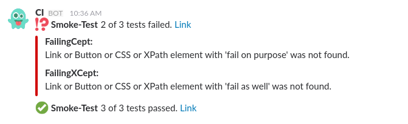

slack-codeception-extension
=============================
This package provides an extension for Codeception to send test results to Slack channels and/or users.

Pre-requisites
-------------

- a pre-configured webhook from the Slack integration "Incoming Webhook"
(see https://api.slack.com/incoming-webhooks for more information)

Installation
-----------

Add the package `ngraf/slack-codeception-extension` to `composer.json` manually or type this in console:

    composer require ngraf/slack-codeception-extension
    
Usage
-----
Enable and configure the extension in your `codeception.yaml`

**Basic** usage:

    extensions:
      enabled:
        - Codeception\Extension\SlackExtension
      config:
        Codeception\Extension\SlackExtension:
           webhook: https://hooks.slack.com/services/...
           
**Advanced** usage:

    extensions:
      enabled:
        - Codeception\Extension\SlackExtension
      config:
        Codeception\Extension\SlackExtension:
          webhook:           https://hooks.slack.com/services/...
           
          # possible notification strategies: always|successonly|failonly|failandrecover|statuschange
          strategy:          always
           
          # If 'true' details about failed tests will be displayed. Default value: 'false'
          extended:          true
           
          # Limit the size of error messages in extended mode. 0 = unlimited. Default value: 80
          extendedMaxLength: 80
           
          # Limit the amount of reported errors in extended mode. 0 = unlimited. Default value: 0
          extendedMaxErrors: 10
           
          # customize your message with additional prefix and/or suffix
           
          messagePrefix:     '*Smoke-Test*'
          messageSuffix:     <http://my-ci/my-job|Link>
          messageSuffixOnFail: <!channel>
           
          # optional config keys that will overwrite the default configuration of the webhook
                      
          channel:           '#any-channel,@any-user'
          channelOnFail:     '#any-channel,@any-user'
          username:          CI
          icon:              :ghost:
           
Example
-----

Dependencies
-----
This package uses the package [maknz/slack](https://github.com/maknz/slack) to communicate with the Slack API.
